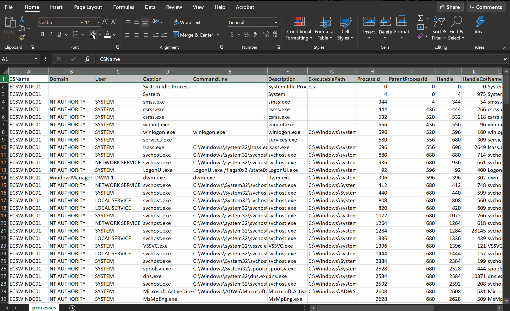

# Remote Process Scanner
C++ commandline utility that enumerates processes running on remote Windows computers.

## Summary
Remote Process Scanner (RPS) is a C++ commandline utility that enumerates processes running on remote Windows computers. This tool can target a single target or a list of targets defined in a line delimited text file. The results of the scan are saved to a single CSV file. 

## Usage and Results
Visual Studios 2019 was used to create this project, however, other versions should work just fine. After compiling the project, a binary executable will be created called rps.exe. The following GIF demonstrates basic usage. *Yes, I know I didn't blur out the lame password in the GIF* ;)

  

After the enumeration process has completed a resulting CSV file is created with the results. Whether you scan one or multiple remote hosts a single CSV file is created. There is a column in the CSV results that tracks which machine the process belongs to, so filtering out by host is easy. The following GIF demonstrates basic filtering.

  

Currently, the only option to specify the authentication password is by specifying it as a commandline argument. So, if this utility is uploaded and ran on a target endpoint that is logging commandline execution, the cleartext username and password will be logged. It would be better to run this utility from a testing machine, however, I will add an option soon to specify a password after execution to mitigate this potetial issue.

## Disclaimer
This proof of concept code has been created for academic research and is not intended to be used against systems except where explicitly authorized. The code is provided as is with no guarentees or promises on its execution. I am not responsible or liable for misuse of this code.
